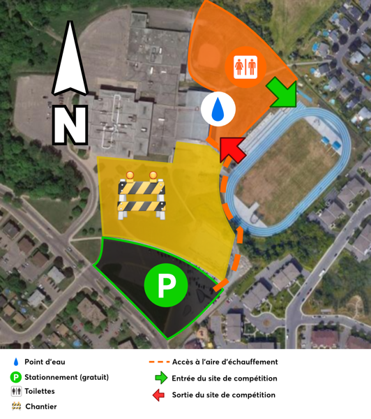
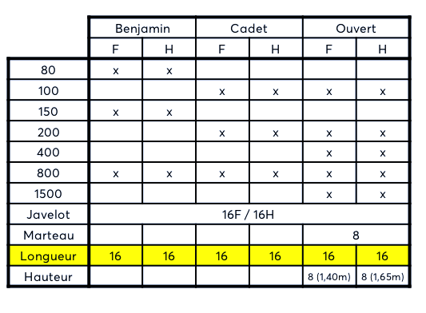

## Informations générales

[Horaire final](https://assets.corsaire-chaparral.org/competitions/2020/1-00-horaire-final-ephemeros-coch-2020.pdf) 
|
[Liste des performances](https://assets.corsaire-chaparral.org/competitions/2020/liste-des-performances.pdf) 
|
[Programme](https://assets.corsaire-chaparral.org/competitions/2020/programme.pdf)

- **Date** : samedi 8 août 2020
- **Information et programme** : [Document technique](https://assets.corsaire-chaparral.org/competitions/2020/1-02-ephemeros-coch-2020-document-technique.pdf)
- **Responsable de la rencontre** : [Samuel Grondin-Bernier](mailto:samuel@corsaire-chaparral.org)
- <em class="badge badge-primary">Nouveau!</em> Ajout d’un 800 m Invitation chez les femmes (minima : **2:08,00**).
- <em class="badge badge-tertiary">COVID-19</em> [Consignes sanitaires + plan d’accès](https://assets.corsaire-chaparral.org/competitions/2020/plan-consignes-sanitaires.pdf)

## Emplacement

**Stade Richard-Garneau**  
401 boul. du Domaine  
Sainte-Thérèse, QC J7E 4S4

Plan d’accès (cliquez pour une image en haute résolution) :

## Épreuves offertes

- 80m (benjamin)
- 100m
- 150m (benjamin)
- 200m
- 400m
- 800m
- 1500m
- Lancer du javelot
- Lancer du marteau
- Saut en longueur
- Saut en hauteur (femmes: 1,40m+ / hommes: 1,65m+)

Pour les épreuves de concours, un chiffre indique le nombre maximal de participants.


### Nouveau!

_L’Ephemeros COCH du 8 août 2020 ajoute à son programme un **800 mètres haute performance** chez les femmes (sur invitation seulement)._  
_Minima : **2:08,00**._  
_Pour plus d’information ou pour prendre part à l’épreuve, veuillez contacter les organisateurs directement._


## Inscription

En ligne, jusqu’au **lundi 3 août 2020, 23 h 59**.

Tarif:

- 1re épreuve: **25,00 $**
- 2e épreuve: **20,00 $**
- 3e épreuve: **15,00 $**

_Les inscriptions sont fermées._

## À propos de l’événement

L’une des premières rencontres d’athlétisme de la reprise COVID-19 au Québec, l’**Ephemeros COCH** propose un éventail d’épreuves pour tous les athlètes en catégorie benjamine, cadette et ouverte.



### _ephemeros_?

Le nom de l’événement vient du grec _ephemeros_, « qui dure un jour ».



