Parmi les faits saillants, on compte les lanceurs de marteau **Cédric Rolland** (2001) et **Ludwig Casaubon**, tous athlètes de la ville de Laval. L’équipe féminine du relais 4x200 s’est également démarquée en fracassant deux records.

## Le COCH s’impose au marteau

**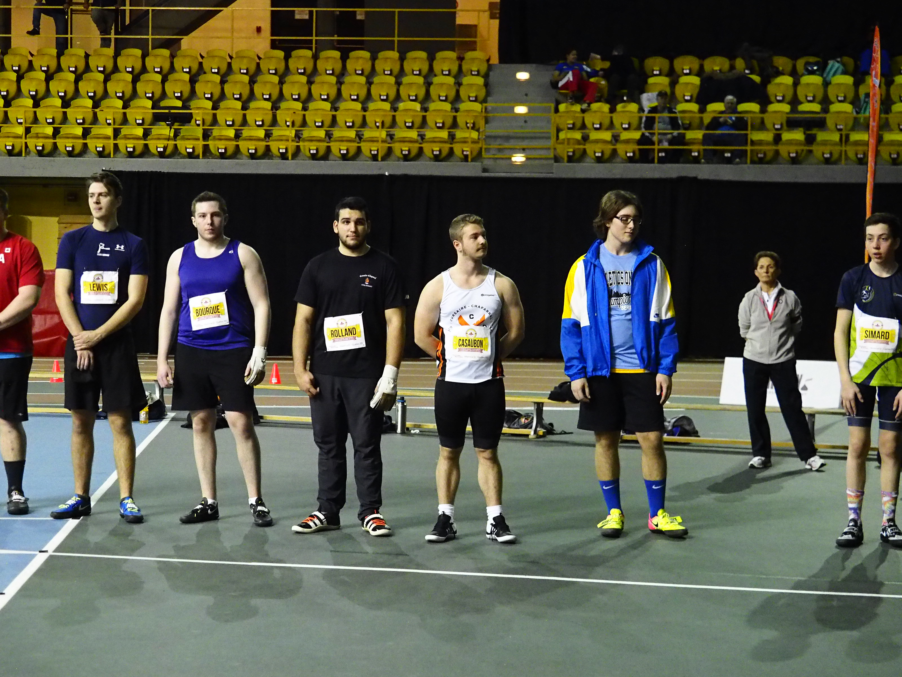**

*Présentation des athlètes masculins au lancer du marteau. (Photo : Louis-Olivier Brassard)*

**Cédric Rolland** (2001) de Laval a remporté le titre de champion canadien au lancer du marteau dans la catégorie des moins de vingt ans (U20).

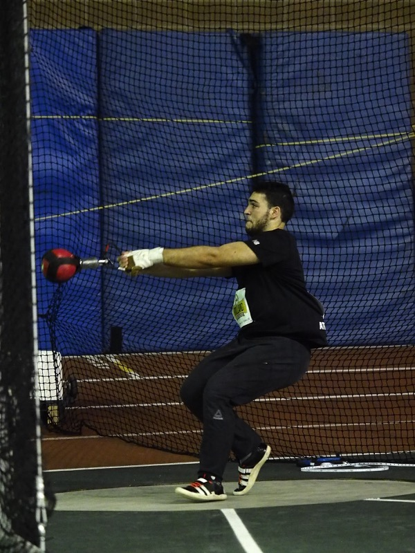

*Cédric Rolland en action lors du lancer du marteau aux Championnats canadiens en salle Hershey. (Photo : Louis-Olivier Brassard*

Cédric détient la meilleure performance québécoise au lancer du marteau intérieur avec la marque de 22,52 mètres.

Avec cette performance, Cédric a établi un **nouveau record du championnat** canadien en salle, dont l’ancienne marque remontait à 2015.  

À noter que Cédric détient toujours le record U18 dans la même discipline, une performance qu’il a établie l’an passée en lançant 22,17m au marteau en salle.

**Ludwig Casaubon** (2002) de Laval a également remporté la  1ère position, mais chez les moins de dix-huit ans (U18).

Ludwig détient la meilleure performance québécoise de la saison au lancer du marteau intérieur avec un lancer 18,25 mètres.

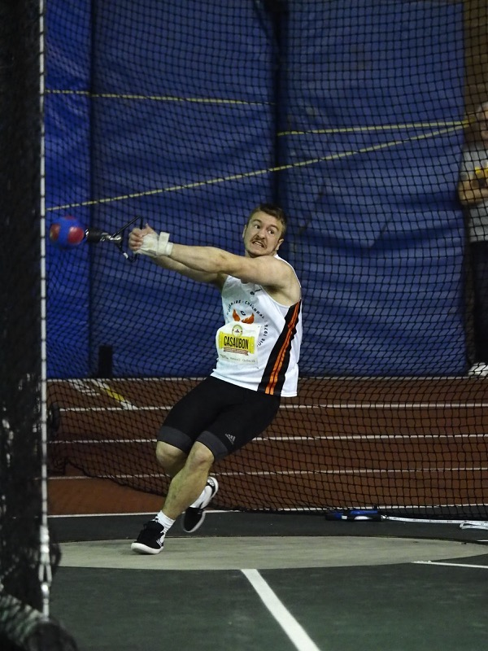

*Ludwig Casaubon en action lors du lancer du marteau aux Championnats canadiens en salle Hershey. (Photo : Louis-Olivier Brassard)*

## Julia Vallée : le vent dans les voiles

Dimanche après-midi, **Julia Vallée** (2004) de St-Joseph-du-Lac a remporté la 2e position en finale du 60 mètres.

Son temps de 7 secondes, 90 centièmes la plaçait tout juste derrière le record de championnat (7,89), lequel a été abaissé à 7,85 secondes par la gagnante Gabrielle Cole, du club ontarien des *Flying Angels*

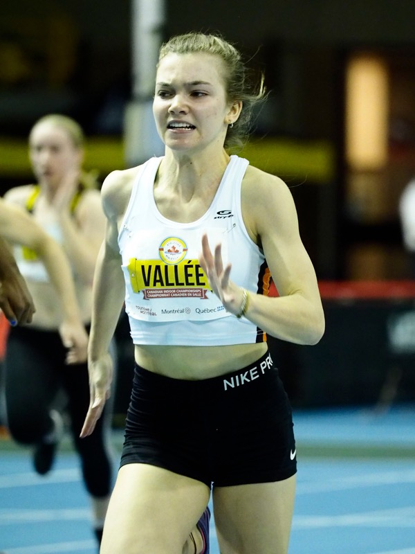

*Julia- Vallée en action lors du 60 mètres U16. (Photo : Louis-Olivier Brassard)*

Même si Julia n’a pas remporté l’or dans cette épreuve, elle aura pu se réjouir l’exploit réalisé par son équipe dans le relais du 4x200 mètres le samedi soir.

Également parmi les participantes au 60 mètres, on compte les athlètes **Alexe Gauthier** (2002) de Terrebonne et **Amanda Faraux** (2002) de Blainville.

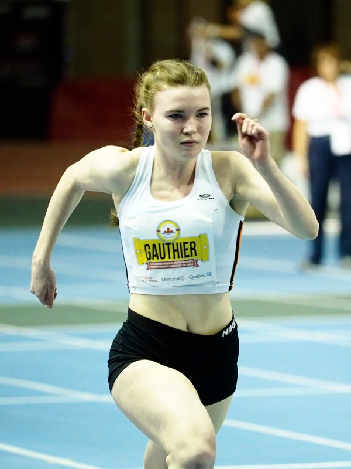

*Alexe Gauthier en action lors des préliminaires du 60 mètres féminin. (Photo : Louis-Olivier Brassard)*

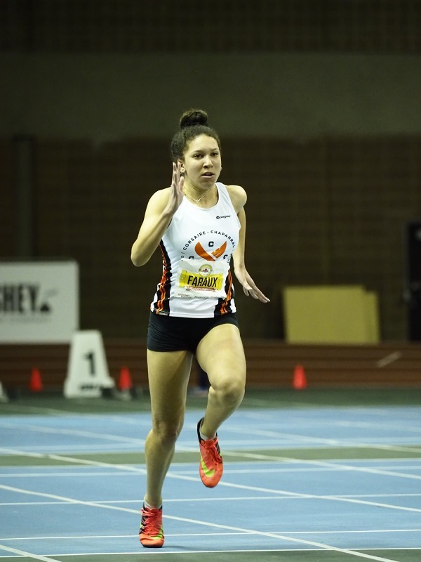

*Amanda Faraux lors du 60 mètres féminin. (Photo : Louis-Olivier Brassard)*

## Le Corsaire-Chaparral, équipe championne du relais 4x200 mètres chez les juvéniles

L’équipe du relais chez les moins de dix-huit ans (U18) a remporté la 1ère position en bouclant les quatre tours de piste en un temps de  **1 minute, 46 secondes, 45 centièmes**, établissant du même coup le nouveau record québécois en salle par club et le record du championnat canadien en salle en pulvérisant l’ancien record (1:48,51) datant du 22 février 2015.

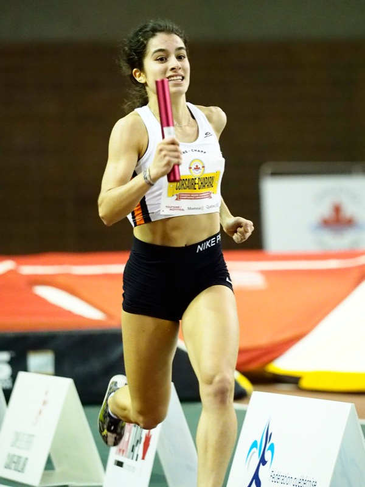

*Mélissa Bitar en action lors du relais 4x200 mètres féminin U18. (Photo : Louis-Olivier Brassard)*

L’équipe du Corsaire-Chaparral était composé des quatre athlètes suivantes (dans l’ordre de la course de relais) :

1. **Ève Finnerty** (2003) de Blainville
2. **Mélissa Bitar** (2003) de Blainville
3. **Amanda Faraux** (2002) de Blainville
4. **Julia Vallée** (2004) de St-Joseph-du-Lac

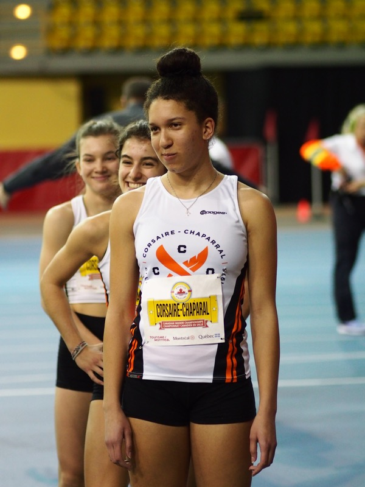

*Les relayeuses du Corsaire-Chaparral, avec, à l'avant-plan, Amanda Faraux. (Photo : Louis-Olivier Brassard)*

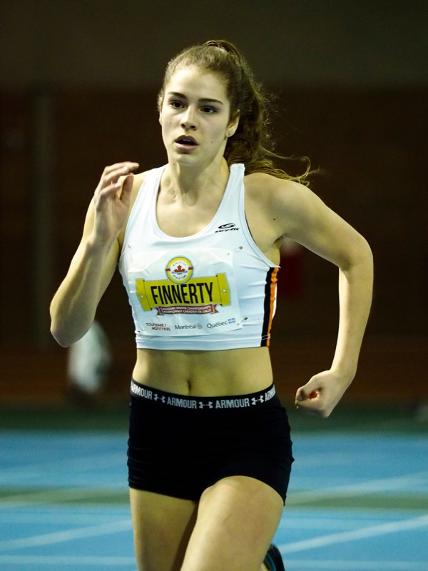

*Ève Finnerty en action lors du 60 mètres féminin. (Photo : Louis-Olivier Brassard)*

On notera que l’ancre de ce relais Julia Vallée, née en 2004, était surclassée dans la catégorie juvénile (U18).

## Des coureurs de demi-fond également présents

Quelques athlètes de demi-fond ont également pris part à la compétition.

**Thomas Laviolette** (de Mascouche, né en 2000) a pris part au 3000 mètres chez les moins de vingt ans, terminant quatrième avec un chrono de 9:34,95.

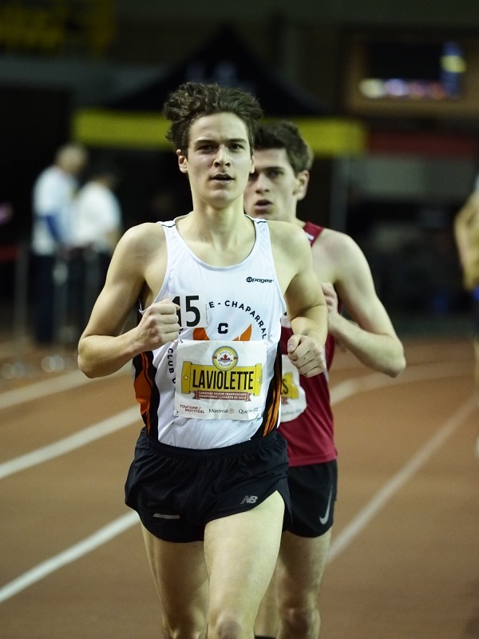

*Thomas Laviolette en action lors du 3000 mètres masculin U20. (Photo : Louis-Olivier Brassard)*

**Simon Prince** (Blainville, 2000) et **Louis Mathivet** (également de Blainville, 2002) ont chacun pris part au 800 mètres, enregistrant respectivement des chronos de 2:10,18 et 2:15,88.

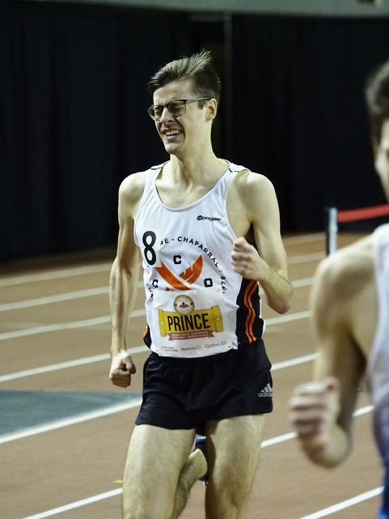

*Simon Prince lors du 800 mètres. (Photo : Louis-Olivier Brassard)*

Louis Mathivet a également pris part à l’épreuve du 400 mètres dimanche, bouclant les deux tours de piste avec un temps de 56 secondes, 18 centièmes, pour la 18e position.

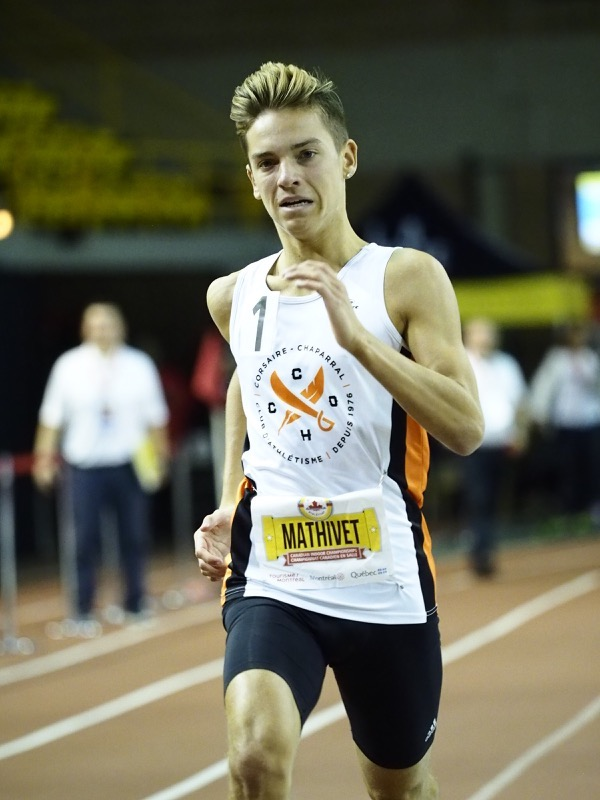

*Louis Mathivet en action lors du 400 mètres masculin U18. (Photo : Louis-Olivier Brassard)*

Vous pouvez voir les [résultats complets](http://liveresults.athletics.ca/Live_Results/2019/Indoor_en_salle/) sur le site web d’Athlétisme Canada.