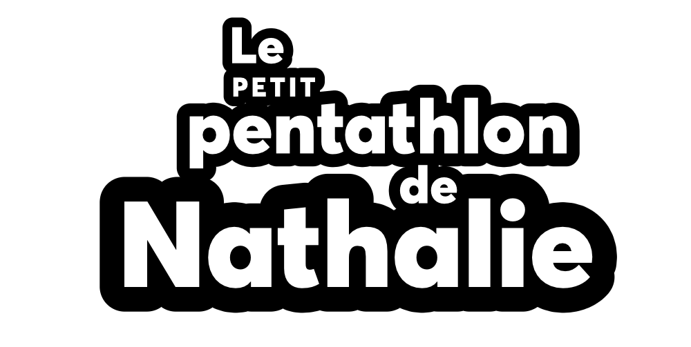

Après plusieurs mois d’activités mouvementées, le club annonce l’ajout de deux nouveaux événements au calendrier provincial: 

- [L’Ephemeros COCH]() samedi 8 août 2020
- [Le petit pentathlon de Nathalie]() dimanche 30 août 2020

## L’Ephemeros, l’une des premières compétitions du circuit provincial dans la reprise COVID-19

[L’Ephemeors]() est une compétition civile de calibre provincial.
Bien que les athlètes en provenance des autres régions soient autorisés à se déplacer, l’événement vise principalement à desservir la clientèle de la grande région métropolitaine (Laurentides, Lanaudière, Laval, Montréal).

L’événement se tiendra le samedi 8 août 2020 au Stade d’athlétisme Richard-Garneau.

En raison des directives gouvernementales limitant les rassemblements à 50 personnes, l’événement se déroulera **sans spectateurs**.
Les athlètes qui prendront part à l’événement devront faire usage de l’espace gazonné à l’extérieur de l’enceinte pour leur échauffement et n’entreront dans le stade que pour prendre part à leur épreuve.

## Le petit pentathlon de Nathalie

[Le petit pentathlon de Nathalie]() fait partie du _Circuit estival des jeunes_, une séries de compétitions amicales pour les 13 ans et moins.
Ce circuit, à vocation initiatique, est chapeauté par la Fédération québécoise d’athlétisme.

Pour l’instant, s’agit du seul événement du genre pour la saison 2020.

Les jeunes en catégorie coccinelle, colibri, minime et benjamin prennent part à un **pentathlon**, une série de cinq épreuves à pointage cumulatif.

L’événement se tiendra le dimanche 30 août 2020 au Stade d’athlétisme Richard-Garneau.
