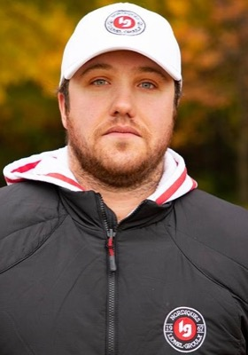

Il a été honoré lors du banquet du Championnat canadien de cross-country 2018 de l’ACSC, présenté par Seneca College à Toronto (Ontario).

_Olivier Lavoie en 2018 (Photo : Mark Quévillon)_

« Selon moi, Olivier et son équipe sont à la barre du meilleur programme de cross-country de l’Association, souligne Bill Corcoran, commissaire de cross-country de l’ACSC. Olivier mérite amplement ce titre. »

L’équipe féminine de Lionel-Groulx a terminé au premier rang du Réseau du sport étudiant du Québec (RSEQ) et a remporté un cinquième championnat provincial consécutif. Quant à l’équipe masculine, elle s’est classée deuxième de la conférence et a terminé le Championnat de cross-country du RSEQ au pied du podium.

L’équipe féminine continue de démontrer constance et profondeur, et cherche toujours à s’améliorer en plus de recruter de meilleures étudiantes-athlètes. Elles tenteront de défendre leur titre de championnes canadiennes cette semaine à Toronto. Chez les hommes, le programme continue de se développer à toute allure.

Lavoie prépare ses étudiants-athlètes en respectant le cadre de développement à long terme de l’athlète. Son objectif, au-delà de l’entraînement physique, est de développer chez ses athlètes des valeurs humaines, tels que le respect, l’entraide, l’honnêteté, l’esprit d’équipe et la persévérance, tout en les incitant à se fixer des objectifs ambitieux.

Grâce à un partenariat avec le Club d’athlétisme Corsaire-Chaparral, les Nordiques peuvent s’entraîner toute l’année dans d’excellentes installations et sous la supervision d’entraîneurs qualifiés comme Lavoie, qui a également été nommé entraîneur de cross-country de l’année de l’ACSC en 2016.

Cette saison, dans le cadre du Programme des apprenties entraîneures, Olivier a mentoré Frédérique Cyr-Deschênes, une ancienne étudiante-athlète de Lionel-Groulx.

Les entraîneurs de l’année de l’ACSC reçoivent une bague personnalisée de Jostens Canada, fournisseur officiel des bagues des championnats canadiens de l’ACSC.

## Autres nominations

* **Kari Elliott, Kings et Queens de Red Deer** : Elliott a guidé les Kings et les Queens à des médailles d’argent lors du dernier Championnat de cross-country de l’ACAC. Depuis qu’elle a pris la tête des équipes de Red Deer en 2016, Kari concentre ses efforts sur le développement de la profondeur du programme en recrutant des coureurs talentueux du secondaire et en développant des étudiants-athlètes au parcours multisports. Elle a également intégré au programme de RDC des spécialistes en santé mentale, en nutrition et en préparation physique. En plus d’être entraîneure personnelle certifiée, Elliott est une coureuse accomplie.
* **Ryan Gagnon, Mountaineers de Mohawk** :  Ancien coureur à Mohawk, Gagnon a mené les Mountaineers à trois médailles lors du Championnat de cross-country de l’OCAA. À sa première saison avec l’institution, il s’est inspiré à la fois de son expérience d’athlète universitaire et de son parcours académique. En tant que nouvel entraîneur avec une équipe qui n’avait dans ses rangs que deux vétérans, Gagnon avait comme objectif de créer un environnement dans lequel ses coureurs pouvaient se développer non seulement en tant qu’étudiants et athlètes, mais aussi en tant que personnes.

## Note
*Cet article est initialement paru le 10 novembre 2018 sur le [site web](http://acsc.ccaa.ca/sports/xc/2018-19/releases/xc_entraineur) de l’Association canadienne du sport collégial.*
